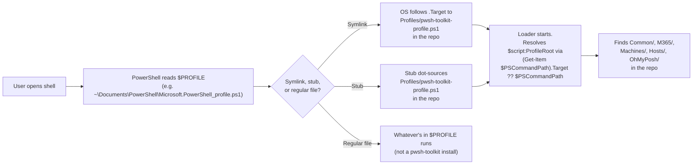

# Profile Loading — How It Works

This document captures how `$PROFILE` resolves, what the loader does once it starts, and the order in which everything is set up. Skim this before changing anything that touches profile-load behavior — small mistakes here are silent and hard to debug (e.g. "my tip never shows", "my prompt is suddenly `PS>`").

---

## 0. Overview

There is **one loader**: `Profiles/pwsh-toolkit-profile.ps1`. Its behavior is driven by `Profiles/config.psd1` (created by `install.ps1` from `config.example.psd1`). Everything that was previously hardcoded into one of two duplicate loader files is now a `config.psd1` knob:

- **Prompt selection** — `Prompt = 'OhMyPosh' | 'Custom' | 'Default'`
- **Toolkit location** (for wrapper helpers like `winup`, `tagdl`) — `ToolkitRoot`
- **OneDrive org** (for `docs`, `desktop`, `onedrive` and the OneDrive jump entry) — `OneDriveOrg`
- **Extra jump destinations** — `ExtraJumpFolders`
- **Optional feature toggles** — `Features.DisableM365`, `DisableStartupTips`

`ToolkitRoot` and `OneDriveOrg` auto-detect from environment when left at `$null` (their default), so a typical install needs zero edits to `config.psd1`.

---

## 1. How `$PROFILE` hooks into the repo

`install.ps1` wires your `$PROFILE` to `Profiles/pwsh-toolkit-profile.ps1` using whichever of two patterns your machine supports:

| Pattern | `$PROFILE` is | Admin? | Live edits? | `$PROFILE` reflects repo? |
|---|---|---|---|---|
| **Symlink** | a symbolic link to the loader file in the repo | Yes (or Developer Mode) | ✅ | ✅ `(Get-Item $PROFILE).Target` shows the repo path |
| **Stub** | a two-line file: `# pwsh-toolkit loader stub` + `. '<repo>\Profiles\pwsh-toolkit-profile.ps1'` | No | ✅ | ⚠️ `Get-Content $PROFILE` shows the dot-source |

Both patterns share the same critical property: **edits inside the repo are picked up by every new shell, no re-install needed**. The differences are aesthetic.

`install.ps1` probes symlink capability with a real test symlink in `$env:TEMP` and picks the symlink path if it works, falling back to the stub silently otherwise. Force the stub path with `install.ps1 -Stub`.

The third option — **copying** the `Profiles/` tree into the user's profile directory — is explicitly **not** supported. It defeats the live-edit property (every change needs a re-copy), and `git status` no longer reflects what your shells run.

### Why does the symlink require admin?

Nothing about `$PROFILE`'s location or the repo path is "protected." The admin requirement is a Windows-wide policy: **creating** a symbolic link requires `SeCreateSymbolicLinkPrivilege`, which is granted only to administrators by default (historical defense-in-depth against symlink-based TOCTOU attacks). Once the symlink exists, any user can follow it — only the `New-Item -ItemType SymbolicLink` call is gated.

**Turning on Windows Developer Mode** (Settings → Privacy & security → For developers → Developer Mode → On) grants the same privilege to your regular user, so the installer succeeds without elevation. Since Windows 10 1703 this is the recommended path. The stub fallback covers everyone else.

### How the loader finds the repo through `$PROFILE`

The loader resolves its own path:

```powershell
$script:ProfileRoot = Split-Path -Parent ([IO.Path]::GetFullPath(
    (Get-Item $PSCommandPath).Target ?? $PSCommandPath
))
```

What this does:

1. `$PSCommandPath` is the path PowerShell used to invoke the loader. Under a symlink, this is the **symlink path** (e.g. `~\Documents\PowerShell\Microsoft.PowerShell_profile.ps1`). Under a stub, this is the loader file directly (the stub's `.` operator passes through).
2. `(Get-Item $PSCommandPath).Target` is the symlink's stored target — or `$null` for a regular file.
3. `?? $PSCommandPath` falls back when `.Target` is `$null` (stub or direct invocation).
4. `Split-Path -Parent` once → `ProfileRoot = <repo>/Profiles/`.

Works identically under symlink, stub, and direct-execution patterns. Don't rewrite this as `Split-Path -Parent $PSCommandPath` — that breaks the symlink case.

---

## Visual reference

Two diagrams summarizing sections 1 (how `$PROFILE` gets resolved) and section 3 (what the loader does once it starts). Render inline on GitHub. If you're reading this in a viewer without Mermaid, the source is still readable as stepped narrative.

### Symlink / stub resolution



### Full load flow

```mermaid
flowchart TD
    Start([Loader starts])
    Start --> Cfg["Load config.psd1 over<br/>config.example.psd1 defaults.<br/>Auto-detect ToolkitRoot + OneDriveOrg."]
    Cfg --> PromptBranch{$Config.Prompt}

    PromptBranch -->|OhMyPosh| OMP["oh-my-posh init pwsh --config <theme><br/>Import Terminal-Icons (if available)"]
    PromptBranch -->|Custom| SkipOMP1[No prompt-tool init]
    PromptBranch -->|Default| SkipOMP2[No prompt-tool init]

    OMP --> Common
    SkipOMP1 --> Common
    SkipOMP2 --> Common

    Common["Enumerate Common/*.ps1 alphabetically:<br/>Aliases → DefaultParameters → Navigation → Peek → Prompt →<br/>PSReadLine → SecretManagement → SystemUtilities → Tips"]
    Common --> CommonLoad{For each file:<br/>OhMyPosh or Default mode<br/>AND file is Prompt.ps1?}
    CommonLoad -->|Yes| SkipPrompt[Skip — something else owns the prompt]
    CommonLoad -->|No| DotSource[Dot-source it]
    SkipPrompt --> M365
    DotSource --> M365

    M365{Microsoft.Graph installed<br/>AND not Features.DisableM365?}
    M365 -->|Yes| M365Load["Dot-source M365/*.ps1"]
    M365 -->|No| Machines
    M365Load --> Machines

    Machines{"Machines/<COMPUTERNAME>.ps1<br/>exists?"}
    Machines -->|Yes| MachLoad["Dot-source it<br/>(per-machine overrides)"]
    Machines -->|No| Hosts
    MachLoad --> Hosts

    Hosts{"Hosts/<HostName>.ps1<br/>exists?"}
    Hosts -->|Yes| HostLoad["Dot-source it<br/>(per-host overrides, e.g. VisualStudioCodeHost.ps1)"]
    Hosts -->|No| OmpTail
    HostLoad --> OmpTail

    OmpTail{OhMyPosh mode?}
    OmpTail -->|Yes| OmpHooks["Update-PoshGraphStatus once<br/>Register PowerShell.OnIdle for live Graph state<br/>Enable-PoshTransientPrompt (if available)"]
    OmpTail -->|No| Tip
    OmpHooks --> Tip

    Tip{"PSPROFILE_NO_TIPS set,<br/>OR DisableStartupTips,<br/>OR Show-ProfileTip missing?"}
    Tip -->|No| ShowTip[Show-ProfileTip — print rotating tip]
    Tip -->|Yes| Silent[Silent]
    ShowTip --> EndNode([Prompt ready])
    Silent --> EndNode
```



These diagrams encode the same logic prose-described in sections 2 (config), 3 (load order), and 4 (cross-file deps) below — useful when tracing "where exactly does my X get loaded?" without reading every paragraph.

---

## 2. The config system

`Profiles/config.example.psd1` is committed and holds defaults. `Profiles/config.psd1` is gitignored and holds the user's overrides (created by `install.ps1` from the example). The loader:

1. Imports `config.example.psd1` first (defaults).
2. If `config.psd1` exists, imports it and shallow-merges it on top (any key the user defines wins).
3. Applies hard fallback defaults for keys absent from both (rare — only happens if both files are missing or fail to parse).
4. Auto-detects `ToolkitRoot` (parent of `Profiles/`) when `$null`.
5. Auto-detects `OneDriveOrg` from `$env:OneDriveCommercial` when `$null`. `''` forces personal OneDrive (no `- Org` suffix).
6. Stashes the result on `$script:Config` so every Common file can read it.

The shallow merge means: if the user defines `Features = @{ DisableM365 = $true }` in `config.psd1`, that **replaces** the entire `Features` hashtable from the example — it doesn't deep-merge. Keep the `Features` block in `config.example.psd1` complete enough that a replace doesn't lose anything important.

---

## 3. Load order: what runs when

| Step | What happens | Notes |
|---|---|---|
| 1 | Resolve `$script:ProfileRoot` (symlink-aware). | See section 1. |
| 2 | Load `config.example.psd1` → optionally merge `config.psd1` → auto-detect `ToolkitRoot` + `OneDriveOrg`. | Result lives on `$script:Config`. |
| 3 | If `Prompt = 'OhMyPosh'`: init `oh-my-posh`, import `Terminal-Icons`. | Fails soft if `oh-my-posh` isn't on PATH — warns and continues. |
| 4 | Enumerate `Common/*.ps1` **alphabetically** and dot-source each. | Skip `Prompt.ps1` when `Prompt` is `'OhMyPosh'` or `'Default'`. |
| 5 | If `Microsoft.Graph` is installed AND `Features.DisableM365` is false: enumerate `M365/*.ps1` and dot-source. | Skipped silently when the module isn't present. |
| 6 | If `Machines/{COMPUTERNAME}.ps1` exists: dot-source. | Per-machine overrides land here. |
| 7 | If `Hosts/{HostName}.ps1` exists: dot-source. | Per-host overrides (e.g. `VisualStudioCodeHost.ps1`; plain terminals report `ConsoleHost`). |
| 8 | If `Prompt = 'OhMyPosh'`: wire `Update-PoshGraphStatus` + `PowerShell.OnIdle` event for Graph state; call `Enable-PoshTransientPrompt` if available. | |
| 9 | Tail: `Show-ProfileTip` unless `$env:PSPROFILE_NO_TIPS` or `$Config.DisableStartupTips` is set. | Env var wins over config (handy for CI). |

Common load order today (alphabetical):

```
Aliases.ps1
DefaultParameters.ps1
Navigation.ps1
Peek.ps1
Prompt.ps1        ← skipped in OhMyPosh / Default modes
PSReadLine.ps1
SecretManagement.ps1
SystemUtilities.ps1
Tips.ps1
```

---

## 4. Cross-file dependencies: what can call what

PowerShell resolves function references at **call time**, not at definition time. A Common file can `Set-Alias foo bar` or define a function whose body calls another function, even if the callee loads later. The reference only has to resolve when the function is **invoked**.

This is why `Aliases.ps1` (loads first) can reference helpers defined in later files without breaking anything — the binding is just a name until you actually run it.

Genuine load-time dependencies in current Common files:

| Caller | Callee | Both loaded before any user call? |
|---|---|---|
| `Aliases.ps1` reads `$script:Config.ToolkitRoot` | `pwsh-toolkit-profile.ps1` sets `$script:Config` | ✅ (loader sets config before any Common file runs) |
| `Navigation.ps1` reads `$script:Config.OneDriveOrg` and `$script:Config.ExtraJumpFolders` | Same | ✅ |
| `Peek.ps1` → `Invoke-JumpTo`, `jb`, `home` (in `Navigation.ps1`) | Alphabetical: `Peek` > `Navigation` | ✅ |
| `Prompt.ps1` → `home`, `onedrive` (in `Navigation.ps1`) | Alphabetical: `Prompt` > `Navigation` | ✅ |
| `Prompt.ps1` → `Get-MgContext` (optional Microsoft.Graph cmdlet) | Guarded with `Get-Command ... -ErrorAction Ignore` | ✅ (degrades to "no M365 segment" when module absent) |

If you add a new Common file that calls another helper **at load time** (not from inside a function body), check the alphabetical order. The safe pattern is: only call helpers from inside function bodies, never at script top level.

**Gotcha** — `-ErrorAction SilentlyContinue` does NOT suppress "command not found" errors, only non-terminating errors from inside a cmdlet that exists. If your function calls a cmdlet from an optional module, guard with `Get-Command -ErrorAction Ignore` first. Otherwise the function throws every time it's called, and (for `prompt`) PowerShell silently falls back to the default `PS>`.

---

## 5. The tip system (step 9 & `Tips.ps1`)

At the tail of the loader:

```powershell
$disableTips = $env:PSPROFILE_NO_TIPS -or $script:Config.DisableStartupTips
if (-not $disableTips -and (Get-Command Show-ProfileTip -ErrorAction SilentlyContinue)) {
    Show-ProfileTip
}
```

This works because `Tips.ps1` is loaded in step 4 (it's in `Common/`), so `Show-ProfileTip` exists by step 9. The `Get-Command` guard means the tip block degrades to silence if `Tips.ps1` is ever removed.

Tip state is cached at `%LOCALAPPDATA%\PSProfile\last-tip.txt` to avoid back-to-back repeats when spawning multiple shells. State writes are wrapped in try/catch — tip rotation is best-effort and never breaks profile load.

---

## 6. Rules of thumb for changes

- **Adding a new helper that's just functions/aliases:** drop a new `.ps1` in `Common/`. It auto-loads. Keep alphabetical position in mind only if it calls other Common helpers at script load time (rare).
- **Adding M365 helpers:** drop a new `.ps1` in `M365/`. Skipped automatically on machines without `Microsoft.Graph` or with `Features.DisableM365 = $true`.
- **Adding a new config knob:** add it to `config.example.psd1` with a sensible default and a comment explaining values. The loader's "hard fallback defaults" block (in `pwsh-toolkit-profile.ps1`) is for keys that might be missing from both files entirely — only add to that block if the key is critical for the loader itself to function.
- **Adding startup behavior (a banner, a check, an init call):** put it in `pwsh-toolkit-profile.ps1`. There's only one loader now — no need to apply changes in two places.
- **Calling an optional cmdlet from a function body:** guard with `Get-Command ... -ErrorAction Ignore`. See the gotcha at the end of section 4.
- **Changing the tip system:** edit `Common/Tips.ps1`. The loader's tail picks it up automatically — no loader edits needed unless you change the call site.
- **Per-machine config (`Machines/<COMPUTERNAME>.ps1`):** dot-sourced in step 6 — after all Common helpers exist but before host-specific config. Safe to call any Common function from here. Safe to append to `$script:JumpFolders`, override `$script:OneDriveOrg`, etc.
- **Per-host config (`Hosts/<HostName>.ps1`):** dot-sourced last (before the OhMyPosh tail and tip). Same call-time guarantees as machine config.
- **Removing a Common file:** check the dependency table in section 4. The Common loader enumerates `*.ps1` blindly — no manifest to update — but other Common files (and the loader tail's `Show-ProfileTip` guard) may depend on it.

---

## 7. Quick diagnostics for "my change didn't take effect"

```powershell
"PROFILE: $PROFILE"
"Is symlink? " + [bool]((Get-Item $PROFILE).LinkType)
"Link target: $((Get-Item $PROFILE).Target)"
"Stub content (if any):"
Get-Content $PROFILE -ErrorAction SilentlyContinue | Where-Object { $_ -match 'pwsh-toolkit-profile' }
""
"Config in effect:"
$script:Config | Format-Table -AutoSize
""
"Common files actually being loaded:"
Get-ChildItem (Join-Path $script:ProfileRoot 'Common\*.ps1') | Select-Object Name
""
"Show-ProfileTip defined? " + [bool](Get-Command Show-ProfileTip -ErrorAction SilentlyContinue)
"PSPROFILE_NO_TIPS = '$env:PSPROFILE_NO_TIPS'"
```

Common failure modes:

- **Prompt is suddenly `PS>` instead of `🚀` / Oh My Posh** — your `prompt` function is throwing on every call. Most likely an unguarded optional cmdlet (see section 4 gotcha). Run `prompt` manually to see the error.
- **`winup` / `tagdl` say "command not found"** — `$Config.ToolkitRoot` doesn't point at a repo containing `WingetUpgrade/` and `DownloadsOrganizer/`. Check `$script:Config.ToolkitRoot` and `$script:WingetUpgradeScript`.
- **OneDrive jump entry points at a nonexistent folder** — `OneDriveOrg` auto-detect found no `$env:OneDriveCommercial` (no Business OneDrive signed in). Set `OneDriveOrg = ''` for personal OneDrive, or an explicit org name.
- **`docs` / `desktop` / `onedrive` error on a fresh box** — same as above.
- **Tip never shows** — either `$env:PSPROFILE_NO_TIPS = '1'` is set, or `$script:Config.DisableStartupTips = $true`, or `Tips.ps1` didn't load (check `Get-Command Show-ProfileTip`).
