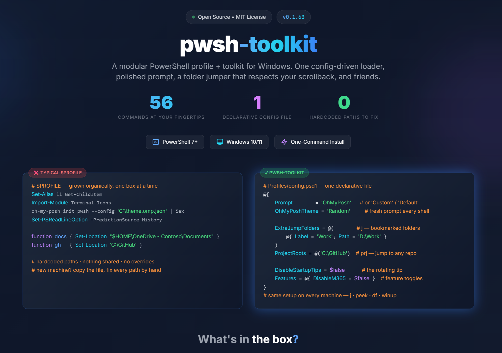

# pwsh-toolkit

<p align="center">
  <a href="https://haakonwibe.github.io/pwsh-toolkit/poster.html">
    
  </a>
</p>
<p align="center">
  <a href="https://haakonwibe.github.io/pwsh-toolkit/poster.html"><strong>📊 View the interactive poster →</strong></a>
</p>

A modular PowerShell profile system + toolkit for Windows. Folder jumper, archive previewer, disk-free overview, interactive winget upgrade picker, AI-tagged Downloads viewer, and a rotating tip system — all wired up through one config-driven loader.

This is a **personal-but-public** setup. It's what I actually run on my own machines; the install script is for anyone who finds something here useful. Not a generic framework, not aiming to be Oh My Posh-scale.

**Try it with zero risk.** `.\install.ps1 -Uninstall` backs out cleanly — it removes only the profile entry it added (leaving your own profile alone) and restores whatever you had before. Nothing to hunt down by hand; `-Purge` clears its caches too.

**Windows-only**, **PowerShell 7+**. macOS / Linux is a future stretch goal, not a present commitment.

---

## Quickstart

```powershell
git clone https://github.com/haakonwibe/pwsh-toolkit.git C:\Tools\pwsh-toolkit
cd C:\Tools\pwsh-toolkit
.\install.ps1
```

That's it. The installer will ask whether you also want to set up Oh My Posh (installs `oh-my-posh`, the Meslo Nerd Font, and the `Terminal-Icons` module, and flips your config to use OMP). Answer yes for the polished prompt; no to keep the dependency-free custom prompt. Open a new PowerShell tab to see the result.

Under the hood, the installer creates a symbolic link from your `$PROFILE` to `Profiles/pwsh-toolkit-profile.ps1` if it can (admin or Windows Developer Mode), and falls back to a dot-source stub otherwise. Either way, edits inside the repo are picked up by every new shell — no re-install needed.

```powershell
# Common installer variants
.\install.ps1 -InstallOhMyPosh   # one-shot polished install (skip the interactive prompt, just do it)
.\install.ps1 -SkipOhMyPosh      # skip the OMP prompt non-interactively (keeps Prompt = 'Custom')
.\install.ps1 -AllHosts          # load in pwsh, VS Code, ISE, ... from one install
.\install.ps1 -Stub              # force the no-admin dot-source stub even if symlinks would work
.\install.ps1 -WhatIf            # dry-run — show what would change without doing it
.\install.ps1 -Uninstall         # cleanly back out (see below)
```

After an OMP install, set your terminal font to a Meslo Nerd Font variant — **MesloLGMDZ Nerd Font Mono** is the recommended pick (Windows Terminal: Settings → Profiles → Defaults → Appearance → Font face).

### Changed your mind?

```powershell
.\install.ps1 -Uninstall          # remove the profile entry, restore any profile we backed up
.\install.ps1 -Uninstall -Purge   # ...and delete the toolkit's caches (theme gallery, tip state, peek temp)
.\install.ps1 -Uninstall -WhatIf  # preview first
```

`-Uninstall` only removes the `$PROFILE` entry **if it's actually a pwsh-toolkit install** (your own profile is left alone), and if `install.ps1` had backed up a previous profile it restores it — so you end up where you started. It deliberately leaves the things it doesn't own and reports them: the cloned repo and your `config.psd1` (just delete the folder), the shared tools an OMP setup installed (`oh-my-posh`, the Nerd Font, `Terminal-Icons`), your SecretStore secrets, and any Windows Terminal font change. Add `-Purge` to also clear the toolkit's machine-local caches.

---

## What you get

| Helper | What it does |
|---|---|
| **`j`** | Interactive folder jumper — picker with digit shortcuts (1-9 instant), arrow keys + Enter, Esc cancel. Renders on the terminal's alternate screen buffer so scrollback is preserved. `j <name>` skips the picker for a direct fuzzy jump against your configured bookmarks; if no bookmark matches, falls through to treating the argument as a literal directory path, so `j C:\Some\Path` works too. |
| **`jb` / `jf`** | Browser-style back/forward through visited folders, per session. |
| **`prj`** | Git-repo jumper. Scans your `ProjectRoots` (config.psd1; defaults to `C:\GitHub`) for repositories and jumps into one — picker with digit shortcuts and current branch shown, or `prj <name>` for a direct fuzzy jump. List is cached per session; `prj -Refresh` rescans. Integrates with `jb`/`jf` history. |
| **`peek <archive>`** | Extracts an archive to `$env:TEMP\peek\<name>-<timestamp>` and jumps you there. Dispatches to WinRAR for `.rar`, 7-Zip for everything else, `Expand-Archive` for `.zip` if neither is installed. `peek -List`, `peek -Active`, `peek -Clean` for the obvious variants. |
| **`df`** | Disk-free overview with colored usage bars (green ≤70%, yellow 71-89%, red ≥90%). Fixed drives by default; `df -All` includes removable, network, and CD-ROM. |
| **`winup`** | Interactive winget upgrade picker. Space to toggle, A toggles all, Enter to confirm. `winup -All` skips the picker. `winup -Elevated` runs it elevated (via gsudo / Windows' built-in `sudo`, else a new elevated window) so you approve one UAC prompt instead of one per package. Logs to `C:\ProgramData\WingetUpgrade\Logs\` in CMTrace XML format. |
| **`tagdl`** | Scans `~\Downloads`, calls Claude Haiku with a structured-output schema, writes a description to each file's NTFS Alternate Data Stream `:description` + a portable `_downloads-index.csv`. Costs ~$0.001 per file. Caches results. |
| **`dird` / `fr`** | Directory listings with the AI descriptions from `tagdl`, color-coded by extension and bucket. `dird` is alphabetical; `fr` is newest-first ("filelisting reverse" — BBS-style paging). |
| **`json`** | View JSON with syntax highlighting — `json <file.json>`, a piped JSON string (`gh api … \| json`), or any piped object (serialized first). Minified JSON is reflowed to indented form; `-Raw` shows the text verbatim (preserving JSONC comments + layout). Emits clean, uncolored JSON when redirected (`json x.json > pretty.json`), so it doubles as a formatter. |
| **`Get-PubIP`** | Public IPv4 and IPv6 with multiple service fallbacks. |
| **`Get-Uptime` / `Get-SysInfo`** | How long since last boot; an at-a-glance panel of host, OS (correct Win11 edition + display version + build), uptime, CPU, memory (with usage bar), GPU, and model. |
| **`Find-File <name>`** | Recursive filename search from the current directory. |
| **`Start-AdminTerminal`** | Launch a new elevated Windows Terminal. |
| **`Get-OrCreateSecret`** | Retrieve a SecretStore secret or prompt to create it. Companion: `Get-StoredSecrets`, `Remove-StoredSecret`. |
| **`rdp` / `rps`** | Remote-server shortcuts driven by `config.psd1`'s `RemoteServers` list. `rdp` launches `mstsc`, `rps` launches `Enter-PSSession`. No arg → picker (digit shortcuts, arrow keys, Esc). `rdp <name-or-address>` → fuzzy match against the configured list first, falling back to treating the argument as a literal address (so `rps 10.0.0.2` and `rdp myhost.lab` work without adding bookmarks first). |
| **`ask <question>`** | Quick reference via the ch.at API. `ask -Brief "..."` for one-line answers. |
| **`wtf`** | Ask Claude Haiku what went wrong with the last error. No-arg explains `$Error[0]`; `wtf "<pasted error>"` works on arbitrary text; `$Error[0] \| wtf` and `Some-Command 2>&1 \| wtf` pipe in. Reuses the `Anthropic-API-Key` SecretStore convention. ~$0.001 per call. |
| **`note` / `today` / `Find-Note` / `Set-NotesRoot`** | Lightweight markdown journal. `note "thing"` appends a timestamped bullet to `<NotesRoot>/YYYY-MM-DD.md`; `today` opens today's file in your default `.md` app. `NotesRoot` auto-detects via cascade (Obsidian vault inside OneDrive → any open vault → OneDrive Documents → local Documents); `Set-NotesRoot` shows the candidates interactively and prints the `config.psd1` snippet for persistence. `Find-Note "term"` greps across every note. |
| **`docs` / `desktop` / `downloads` / `onedrive` / `home`** | Named navigation shortcuts. OneDrive paths auto-detect your Business org from `$env:OneDriveCommercial`. |
| **`mkcd` / `up` / `..` / `...`** | `mkcd <dir>` creates a directory (and parents) and changes into it; `up [n]` ascends `n` levels (default 1); `..` / `...` are quick one/two-level shortcuts. |
| **`sudo <command>`** | Run a command elevated. Delegates to a real `sudo` when present so it elevates in the *current* window — [gsudo](https://github.com/gerardog/gsudo) first, then Windows' built-in `sudo` (Windows 11 24H2+, once enabled in Settings → System → For developers). Falls back to a new elevated window when neither is available. No-arg opens an elevated shell; `-Verbose` reports which backend it used. |
| **`toolkit` / `Get-ToolkitCommand`** | The "what can I do here?" command — since the toolkit isn't a module, this is its `Get-Command -Module` equivalent. `toolkit` prints every command grouped by area with a one-line synopsis; `Get-ToolkitCommand` returns the same as objects to pipe/filter (`Get-ToolkitCommand \| Where Group -eq 'Secrets'`). `-All` includes internal helpers. The list is discovered from the source at runtime, so it never goes stale. |
| **`tip`** | Re-roll the rotating profile tip. Set `$env:PSPROFILE_NO_TIPS=1` to silence at startup. |
| **`Get-TerminalFont` / `Set-TerminalFont`** | Read or change the Windows Terminal font face. `Get-TerminalFont` reports the effective font for the PowerShell profile; `Set-TerminalFont '<name>'` updates `settings.json` with a targeted, value-only edit (backs it up, validates the JSON, doesn't reflow the file) — Terminal reloads automatically. `-WhatIf` previews. |
| **`Update-PoshThemes` / `Set-PoshTheme` / `Get-PoshTheme`** | Oh My Posh theme tools. `Update-PoshThemes` downloads the full ~120-theme gallery into a local cache; `Set-PoshTheme` is a `Show-Picker` over all themes (+ a Random entry) that previews live and prints the config snippet; `Get-PoshTheme` reports the active theme. Set `OhMyPoshTheme = 'Random'` for a different theme each shell (the loader names the one it rolled so you can pin it). |
| **`ll` / `la` / `lh` / `touch` / `which`** | The shell-script staples. `ll` lists; `la` adds hidden/system entries; `lh` shows *only* hidden/system entries; `touch` creates files or bumps timestamps without ever truncating (accepts paths + multiple targets); `which` resolves a command to its backing path, alias target, or kind. |

**M365 helpers** (loaded only if `Microsoft.Graph` is installed): `Connect-Tenant`, `Connect-Exchange`, `Get-TenantOverview`, `Get-TeamsInfo`, `Disconnect-Tenant`, `Disconnect-Exchange`.

> Every command carries `Get-Help` documentation — try `Get-Help touch -Examples` or `Get-Help j` for usage and examples right in the terminal. The rotating startup `tip` is the at-a-glance counterpart.

---

## Screenshots

Captured against a clean Windows Terminal with **MesloLGMDZ Nerd Font Mono** and `Prompt = 'OhMyPosh'` — i.e. exactly what `install.ps1 -InstallOhMyPosh` gives you. See [`docs/screenshots/CAPTURE-GUIDE.md`](docs/screenshots/CAPTURE-GUIDE.md) if you want to retake or extend.

### The shell at rest


A fresh tab: rotating profile tip on top, the polished Oh My Posh prompt with `pwsh` + user + battery + clock segments below.

### Folder jumper (`j`)


Press `1`-`9` for an instant jump, or arrow + Enter. Renders on the terminal's alternate screen buffer so your scrollback stays intact when the picker exits. `j <text>` (or any literal path) skips the picker entirely.

### Disk-free overview (`df`)


Fixed drives by default with colored usage bars (green ≤70%, yellow 71-89%, red ≥90%). `df -All` adds removable, network, and CD-ROM drives.

### Archive peek (`peek`)


Dispatches to WinRAR for `.rar`, 7-Zip for everything else, and falls back to `Expand-Archive` for plain `.zip` if neither is installed. `peek <archive>` extracts to `$env:TEMP\peek\…` and jumps you in.

### Interactive winget upgrade (`winup`)


Space to toggle, A toggles all, Enter to confirm. CMTrace-XML logs land in `C:\ProgramData\WingetUpgrade\Logs\`. `winup -All` skips the picker. `winup -Elevated` re-runs it elevated through a real `sudo` (gsudo or Windows' built-in `sudo`, falling back to a new elevated window) so you approve one UAC prompt up front rather than one per package.


---

## Configuration

The installer seeds `Profiles/config.psd1` from `Profiles/config.example.psd1`. Edit it to customize:

```powershell
@{
    Prompt        = 'Custom'              # 'OhMyPosh' | 'Custom' | 'Default'
    OhMyPoshTheme = 'default.omp.json'    # OMP only. A theme name, a path, or 'Random'
                                          # (a different one each shell — see Set-PoshTheme)
    ToolkitRoot   = $null                 # $null = auto-detect (parent of Profiles/)
    OneDriveOrg   = $null                 # $null = auto-detect from $env:OneDriveCommercial,
                                          # ''   = personal OneDrive, 'Name' = explicit

    ExtraJumpFolders = @(
        # @{ Label = 'GitHub'; Path = 'C:\GitHub' }
        # @{ Label = 'VMs';    Path = 'D:\VMs'   }
    )

    DisableStartupTips = $false
    Features = @{ DisableM365 = $false }
}
```

For more complex per-machine logic (registering network drives, machine-specific functions, conditional setup), drop a `Profiles/Machines/<COMPUTERNAME>.ps1` — it's dot-sourced after the Common helpers load. Same pattern for `Profiles/Hosts/<HostName>.ps1` for per-host tweaks — e.g. a `Hosts/VisualStudioCodeHost.ps1` that swaps Oh My Posh for the lightweight Custom prompt in the VS Code PowerShell extension terminal (plain terminals, including Windows Terminal, report `ConsoleHost`). Copy-ready `*.ps1.example` templates live in both folders; see their READMEs.

`config.psd1` is gitignored — your edits stay local.

---

## Requirements

- **Windows 10/11**
- **PowerShell 7+** (`winget install Microsoft.PowerShell`)
- An **execution policy** that allows local scripts: `Set-ExecutionPolicy -Scope CurrentUser RemoteSigned`

The installer checks PowerShell version and stops with a clear message if you're on 5.1.

## Optional dependencies

The profile loads fine without any of these — the relevant feature just stays dark until you add it.

| Want | Install |
|---|---|
| `Prompt = 'OhMyPosh'` (the polished prompt) | `.\install.ps1 -InstallOhMyPosh` does the whole setup. (Manual: `winget install JanDeDobbeleer.OhMyPosh` + `oh-my-posh font install Meslo --user` + `Install-Module Terminal-Icons`.) |
| `tagdl` (AI Downloads tagger) and `wtf` (Claude-powered error explainer) | `Install-Module Microsoft.PowerShell.SecretManagement, Microsoft.PowerShell.SecretStore`, then store an `Anthropic-API-Key` secret with `Get-OrCreateSecret -Name 'Anthropic-API-Key'`. Both reuse the same key. |
| `peek` for `.rar` / `.7z` / `.tar.gz` / ISO / etc. (not just `.zip`) | `winget install 7zip.7zip` (and/or WinRAR for `.rar`) |
| M365 helpers (`Connect-Tenant`, `Get-TenantOverview`) | `Install-Module Microsoft.Graph, ExchangeOnlineManagement` |

---

## Security

Secrets used by helpers like `tagdl` are stored via [Microsoft.PowerShell.SecretStore](https://learn.microsoft.com/en-us/powershell/module/microsoft.powershell.secretstore), which encrypts at rest using Windows DPAPI. The encryption keys are tied to your Windows user account.

**What this protects against:** accidental commits of API keys (secrets live in `%LOCALAPPDATA%`, never in the repo), env-var leaks via process listings (`Get-Process` won't show them), and access by other Windows users on the same machine.

**What it does NOT protect against:** compromise of your Windows user account (DPAPI keys derive from it), process memory inspection by code running as you, or `SecureString` analysis — Microsoft has [formally deprecated `SecureString` as a security boundary in .NET 6+](https://learn.microsoft.com/en-us/dotnet/api/system.security.securestring). Treat it as an obfuscated string, not a vault.

For higher-assurance storage (separate vault password, keys not derived from your Windows account), use a tool like [1Password CLI](https://developer.1password.com/docs/cli/) or [Bitwarden CLI](https://bitwarden.com/help/cli/) and pipe the secret to the wrapper at runtime instead of via `Get-OrCreateSecret`.

**Passwordless by default.** When `Get-OrCreateSecret` first sets up the vault for a new user, it configures `Authentication = None` — DPAPI is the only security boundary, which is honest about what's actually protecting the secrets. No per-session password prompts.

If you want the extra layer (vault password on top of DPAPI), run once after setup:

```powershell
Set-SecretStoreConfiguration -Authentication Password
```

Existing vaults aren't touched — the default only applies on first-time vault creation. To change an already-configured vault, use the command above (with the current password if there is one).

## Connecting to remote hosts

`rdp` and `rps` are thin wrappers — the targets still need the right server-side bits enabled. Quick reference:

### RDP target setup

Run elevated on the **target** machine:

```powershell
# Enable RDP
Set-ItemProperty -Path 'HKLM:\System\CurrentControlSet\Control\Terminal Server' -Name 'fDenyTSConnections' -Value 0
# Open the firewall
Enable-NetFirewallRule -DisplayGroup 'Remote Desktop'
# Optionally let non-admins connect
# Add-LocalGroupMember -Group 'Remote Desktop Users' -Member 'lab\someuser'
```

Windows **Home** SKUs don't include the RDP server; Pro / Enterprise / Server do. Azure VMs typically come with this already enabled.

### PSRemoting target setup

Run elevated on the **target** machine:

```powershell
Enable-PSRemoting -Force
```

That's it for domain-joined targets — Kerberos handles auth automatically when you connect as a domain account. Windows **Server** SKUs have WinRM enabled by default since 2012 R2; Windows 10/11 client SKUs do not, so this one-liner is still needed there.

### Cross-domain / workgroup (TrustedHosts)

When the target isn't in your AD domain (workgroup machine, lab VM, IP-only target), one more step on **this client**:

```powershell
Set-Item WSMan:\localhost\Client\TrustedHosts -Value 'targethost' -Concatenate -Force
```

If you hit this in the wild, `rps` will detect the error message and print this exact remediation command with the target address pre-filled — you can usually just copy/paste from the failure output.

### Sanity checks

```powershell
Test-NetConnection target -Port 3389       # RDP reachable?
Test-NetConnection target -Port 5985       # WinRM HTTP reachable?
Test-WSMan target                          # WinRM actually responding?
```

## Documentation

- **[`Profiles/README.md`](Profiles/README.md)** — module structure, helper reference, installation alternatives
- **[`Profiles/LOADING.md`](Profiles/LOADING.md)** — loader internals, load order, cross-file dependencies. Read this before touching `pwsh-toolkit-profile.ps1`.
- **[`docs/ARCHITECTURE.md`](docs/ARCHITECTURE.md)** — design decisions and load-bearing conventions. Read this before contributing.
- **[`Profiles/OhMyPosh/README.md`](Profiles/OhMyPosh/README.md)** — OMP prompt segments, theme customization
- **[`Profiles/Machines/README.md`](Profiles/Machines/README.md)** — per-machine configuration examples
- **[`Profiles/Hosts/README.md`](Profiles/Hosts/README.md)** — per-host configuration examples
- **[`CHANGELOG.md`](CHANGELOG.md)** — release history
- **[`IDEAS.md`](IDEAS.md)** — candidate future helpers (`prj`, `recent`, `gcm`, `cb`)

## Future direction

The eventual v2 plan is to split this into a module on PSGallery (`pwsh-toolkit`) + a dotfiles repo importing it (`pwsh-profile`). For day one it's one repo — simpler to fork, simpler to understand, no PSGallery publish gate. v2 is a thought, not a commitment.

## License

MIT. See [LICENSE](LICENSE).
